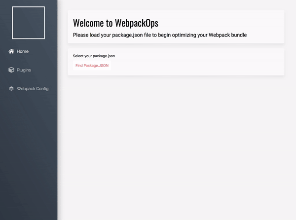
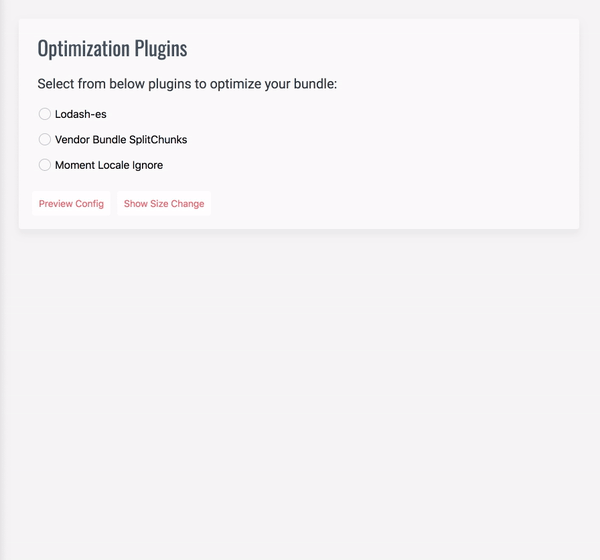
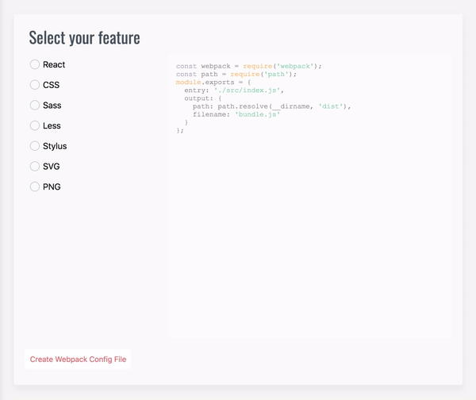

# WebpackOps


WebpackOps is a Webpack bundle visualization, optimization and customization tool that helps developers streamline the size of their webpack bundle through customized plugin selection and webpack config file generation. Webpack Ops also allows developers to visualize their bundle assets through interactive analysis charts. 



## Installation

**1.** Clone or Download the repository.
```
git clone https://github.com/CatSnake11/Webpack-Optimizer.git
```

**2.** Open the repository, go to your terminal and run the following commands to download all required libraries:
```
npm install
npm run webpack
npm start
```

Download and install WebpackOps for Mac or Windows, and launch the application: http://www.webpackops.com.

## Usage
WebpackOps has three tabs - *Home*, *Plugins*, and *Webpack Config*. Below, please find instructions on how to use each tab:

**Home**
- Select your `package.json` file by clicking the "Find Package.JSON" button and selecting your `package.json` file.
- Select desired build configuration and click "Select Config" button.
- Click "Load Stats File" button and select the `stats.json` file that was generated in your local repository.
- Enjoy! You can now analyze your Webpack bundle in the four charts that are provided - Sunburst, Zoomable Sunburst, Treemap, and Zoomable Treemap.

**Plugins**
- Once you have loaded your `package.json` and `stats.json` files on the *Home* tab, select the plugins you would like to install in your Webpack bundle.
- Click the "Preview Config" button to preview your `webpack.config` file with selected plugins.
- Click the "Show Size Change" button to display a visual representation of your bundle size reduction.



**Webpack Config**
- This tab will guide you in generating a custom `webpack.config` file for your project.  First, click the "*Select*" button to select your local repository where you would like to generate your `webpack.config` file.
- Next, select the languages, libraries, and frameworks you would like to add to your `webpack.config`. You can preview what your config will look like in the text window on the right. 
- Once you have selected all desired features, click "Create Webpack Config File" to generate a new `webpack.config` file in your local repository.



## Built With
- [React](https://github.com/facebook/react)
- [Acorn](https://github.com/acornjs/acorn)
- [MobX](https://github.com/mobxjs/mobx)
- [TypeScript](https://github.com/Microsoft/TypeScript)
- [D3](https://github.com/d3/d3)
- [Jest](https://github.com/facebook/jest)

## Authors
- Hei Yeung Lam (https://github.com/heiyeunl)
- Dave Marquess (https://github.com/davemarquess)
- Tony Hudgins (https://github.com/Tonyhudgins)

## License
This project is licensed under the MIT License - see the LICENSE.md file for details

